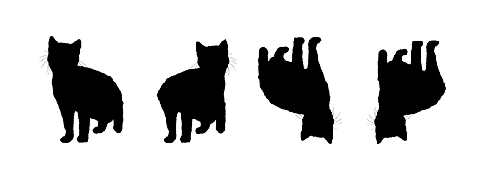
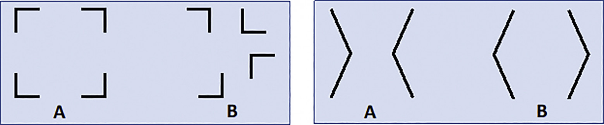
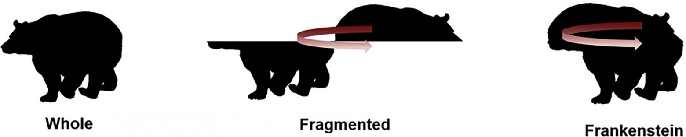
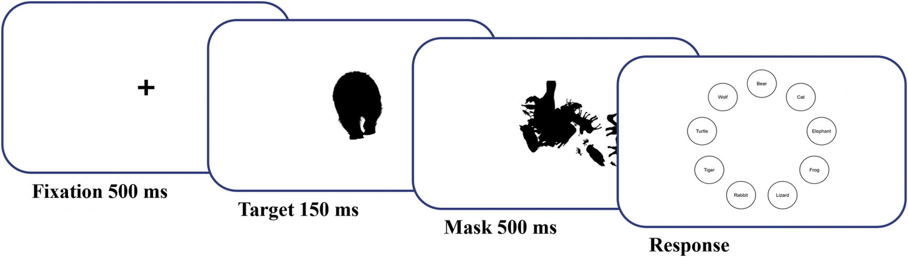
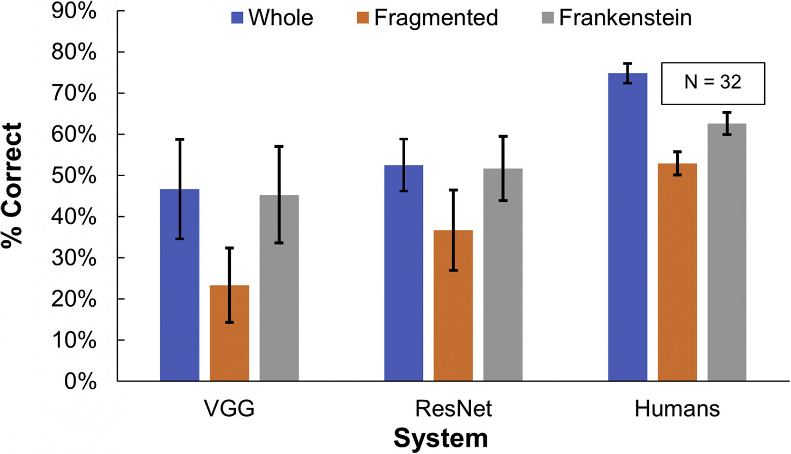
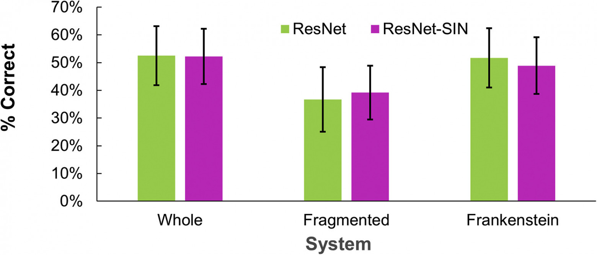
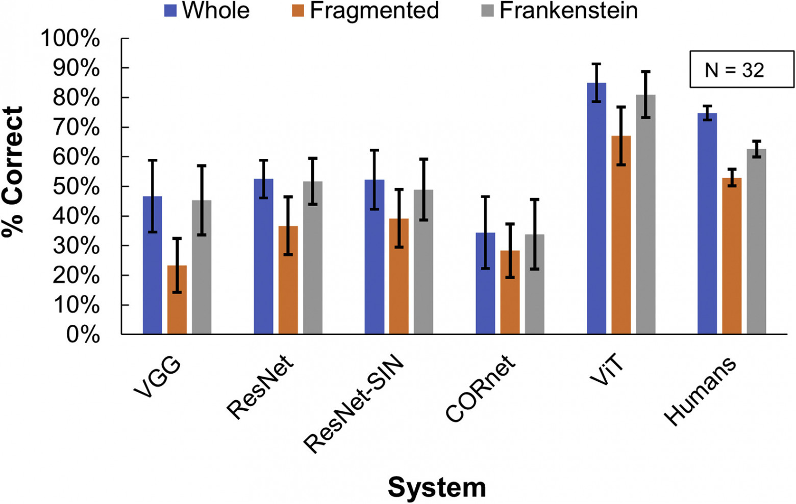

__Видеть больше: ИИ против человека__

Многие футуристы яро отстаивают мнение, что искусственный интеллект может стать погибелью человечества. Возможно в далеком будущем и появится аналог HAL 9000, который монотонным голосом оповестит нас о том, что наше время на этой планете истекло, но это уж точно не произойдет в ближайшие десятилетия. А все дело в том, что киношные или литературные ИИ стоят выше или на той же ступени мыслительных способностей, что и человек. В реальности же это не так. Ученые из Йоркского университета (Торонто, Канада) провели ряд экспериментов, показавших насколько ИИ уступает человеку в рамках визуального восприятия объектов. Какие эксперименты были проведены и что именно они показали? Об этом мы узнаем из доклада ученых.

__Основа исследования__

Одними из самых продвинутых систем искусственного интеллекта на данный момент считаются глубокие сверточные нейронные сети (DCNN от _deep convolutional neural network_). В аспекте компьютерного зрения лучше их не найти. DCNN также вполне неплохо количественно предсказывает нейронную реакцию в объектно-селективных зрительных областях коры головного мозга, хоть и были обнаружены некоторые расхождения между самой реакцией и предсказаниями системы.

Для того чтобы создать какую-либо систему, имитирующую человеческое восприятие информации, необходимо определить ряд важных параметров. В первую очередь, это тип информации (в данном случае, визуальные сигналы). Затем составить перечень отличительных черт, которые помогают нам идентифицировать объект — цвет, текстура, форма и т. д.

Многочисленные исследования говорят о том, что для нас важным элементом восприятия объектов является их форма. Ранее говорилось, что системы DCNN меньше полагаются на форму и больше на цвет и текстуру, чем люди. Но форма все же используется DCNN в качестве дополнительного параметра, т. е. она полностью не исключается.

В рассматриваемом нами сегодня труде ученые поставили перед собой любопытную задачу — сравнить использование форм системой DCNN и человеком, а также определить, у кого это получается лучше.

__Теория форм__

Объекты имеют как локальные, так и конфигурационные свойства формы. Локальное свойство формы проявляется в ограниченной области объекта и может интерпретироваться без ссылки на более отдаленные особенности формы объекта. Локальные свойства формы могут играть важную роль в распознавании как для людей, так и для искусственных систем (к примеру, ушей кролика может быть достаточно, чтобы правильно его идентифицировать), а несколько слабых локальных свойств объекта потенциально могут быть накоплены для получения относительно сильных классификаторов.

_Изображение №1_

Напротив, конфигурационное свойство формы является функцией не только одной или нескольких конкретных локальных особенностей, но и того, как эти особенности связаны в пространстве (пример выше).

Многие из свойств формы, которые наиболее заметны для человека (например, выпуклость или симметрия), являются конфигурационными и проявляются не локально, а только в результате целостного вычисления, которое учитывает пространственное расположение локальных особенностей формы. Эти умозаключения были подтверждены эмпирически, как с помощью психологических тестов, так и фМРТ.

До того как глубокие нейросети стали лидерами в мире искусственного интеллекта, первенство в распознавании объектов занимало компьютерное зрение (например, SIFT). Такие системы полагались в первую очередь на суммирование данных по локальным особенностям, в значительной степени игнорируя пространственные конфигурационные отношения между этими чертами.

Модели DCNN значительно превосходят эти более ранние системы распознавания. Поскольку единицы в более высоких сверточных и полностью связанных слоях имеют большие рецептивные поля, которые объединяют информацию из широко разнесенных пикселей посредством сложного нелинейного отображения, эти сети потенциально могут выйти за рамки суммы доказательств по локальным функциям для включения конфигурационной информации. Другими словами, современные DCNN системы лучше, так как могут учитывать в своем анализе объектов как локальные, так и конфигурационные свойства.

Однако, как утверждают некоторые ученые, на самом деле DCNN, обученные ImageNet, могут вести себя как классификаторы с набором функций. Хотя выводы ученых могут отражать преобладание текстурных сигналов, а не обработки формы как таковой, результаты исследований предполагают, что DCNN придают большее значение локальным сигналам формы, чем глобальным, по крайней мере, для простых геометрических форм, если сравнивать эти системы с человеком. Также эти системы кажутся относительно нечувствительными к перестройкам в конфигурации локальных частей.

Такого рода выводы поднимают весьма любопытный вопрос — чувствительны ли вообще модели глубоких нейросетей к конфигурационным свойствам формы. Чтобы ответить на этот вопрос, авторы рассматриваемого нами сегодня труда провели ряд экспериментов, о результатах которых мы и поговорим далее.

__Результаты исследования

Эксперимент I: конфигурационная чувствительность людей и DCNN__

Чтобы сравнить конфигурационную чувствительность людей и DCNN, ученые измерили и сравнили успешность выполнения задачи по классификации животных с 9 альтернативами. Объекты тестов (т. е. животные) были визуализированы в виде силуэтов, таким образом изолируя форму как ключевой аспект.

_Изображение №2_

Чтобы разделить конфигурационные и локальные сигналы формы, были применены две отдельные манипуляции к объектам (изображение №2). Эти изменения нарушали глобальную конфигурацию, но не трогали локальные особенности формы. Затем проводилось сравнение результатов восприятия людьми и DCNN как исходных объектов, так и измененных.

Первая манипуляция заключалась во фрагментировании объекта: верхняя половина переворачивалась по вертикальной оси зеркально и смещалась в крайний левый/правый угол. Эта манипуляция разделяет конфигурацию на два отдельных смежных объекта, но в значительной степени сохраняет локальные особенности формы.

Вторая манипуляция была названа «Франкенштейн»: в этом варианте сдвинутая перевернутая половина возвращалась обратно. В отличие от фрагментированного состояния, эта манипуляция сохраняет стимул как единый объект, но при этом нарушается конфигурационная взаимосвязь между элементами формы в верхней части объекта и элементами формы в нижней части объекта.

_Изображение №3_

Основной критерий измерения в ходе сравнительного теста была способность человека или системы DCNN (обученной на ImageNet) правильно идентифицировать животное для каждого из трех состояний объекта (изначальное, фрагментированное и Франкенштейн). Результаты анализировались с помощью обобщенного линейного анализа смешанных эффектов, где испытуемые и животные были случайными эффектами, а системы (человек, VGG-19, ResNet-50) и конфигурационные свойства — фиксированными. Выше представлена примерная схема эксперимента.

_Изображение №4_

В целом ResNet-50 показал себя несколько лучше, чем VGG-19 (MResNet = 0.47, MVGG = 0.38), но оба были значительно хуже, чем люди (Mhumans = 0.64, MResNet = 0.47; Mhumans = 0.64, MVGG = 0.38).

Было обнаружено, что фрагментация ухудшает распознавание как для людей, так и для сетей (люди: Mwhole = 0.74, Mfragmented = 0.53; ResNet-50: Mwhole = 0.53, Mfragmented = 0.37; VGG-19: Mwhole = 0.47, Mfragmented = 0.24).

Причиной ухудшения восприятия фрагментированного объекта может быть нарушение конфигурационных отношений между элементами в верхней и нижней части объекта. Также причиной может быть и заметные и весьма отвлекающие локальные артефакты (четкая горизонтальная линия разделения объекта пополам, резкий разрыв объекта по горизонтали). Еще одна причина может таится в восприятии объекта не как одного целого, просто разделенного пополам, а как двух отдельных объектов.

Состояние «Франкенштейн» различает эти объяснения, нарушая конфигурационные отношения, сводя к минимуму введение новых существенных локальных особенностей и сохраняя внешний вид стимула как единого объекта. Было установлено, что, хоть манипуляция «Франкенштейн» по-прежнему сильно влияла на восприятие человеком (Mwhole = 0.75, MFrankenstein = 0.63), на восприятие сетей этого влияния не было (VGG-19: Mwhole = 0.47, MFrankenstein = 0.46; Resnet-50: Mwhole = 0,53, MFrankenstein = 0.52).

Этот результат говорит о том, что исследуемые DCNN, обученные на ImageNet, не могут уловить человеческую конфигурационную чувствительность восприятия объектов.

__Эксперимент II: может ли усиление сигналов формы привести к конфигурационному восприятию формы?__

Предыдущие исследования показывают, что, по сравнению с людьми, DCNN, обученные ImageNet, больше полагаются на текстуру, чем на информацию о форме для распознавания объектов. Следовательно, снижая надежность информации о текстуре во время обучения, DCNN можно научить повышать значимость сигналов формы до человеческого уровня. Но какие сигналы формы использует эта переобученная сеть? Обрабатывает ли он формы конфигурационно, как люди, или переобучение просто заменяет локальные сигналы формы локальными сигналами текстуры?

Чтобы получить ответы на эти вопросы, ученые провели эксперимент, в котором тестировалась система ResNet-50 со смещением формы обученной на Stylized ImageNet (SIN) — вариация ImageNet, в которой текстура изображения становится менее надежной в качестве сигнала.

_Изображение №5_

Авторы данного метода обучения системы (т.е. с применением SIN) утверждают, что оно улучшает эффективность классификации силуэтов. Однако в ходе эксперимента этого улучшения видно не было ни для обычного набора силуэтов животных (MImageNet = 0.47, MSIN = 0.47), ни для конкретных экспериментальных вариантов состояния объекта (MImageNet whole = 0.53, MSIN whole = 0.52; MImageNet fragmented = 0.37, MSIN fragmented = 0.39; MImageNet Frankenstein = 0.52, MSIN Frankenstein = 0.49).

Из этого следует, что переобучение сети для увеличения информации о форме не приводит к конфигурационной обработке, подобной человеческой. Таким образом, улучшения, которые наблюдали авторы методики обучения, могут быть обусловлены локальными особенностями формы, которые более информативны для их набора данных.

__Эксперимент III: могут ли другие архитектуры сетей привести к конфигурационной обработке?__

Архитектура стандартных DCNN систем намного проще архитектуры зрительной коры мозга человека. Обработка осуществляется с прямой связью, систематически переходя от мелких к более крупным особенностям, при этом глобальные взаимодействия ограничиваются конечными слоями. Напротив, зрительная кора имеет массивные повторяющиеся и пропускающие связи, которые могут объединять глобальную и локальную информацию на ранних этапах обработки, что может иметь решающее значение для конфигурационного восприятия.

Исследования мозга человека подтверждают, что рекуррентные связи в зрительной коре важны для распознавания объектов и для фиксации пространственных зависимостей, лежащих в основе конфигурационного восприятия.

Чтобы проверить, может ли повторение привести к конфигурационной обработке формы, ученые повторили вышеописанный эксперимент с CORnet — рекуррентная DCNN, вдохновленная архитектурой _вентрального потока_* приматов.

__Потоки обработки визуальной информации__* — существует гипотеза о существовании в коре мозга двух потоков обработки визуальной информации: вентральный обрабатывает предметную (т. е. что?), а дорсальный — пространственную (т. е. Где?).

CORnet состоит из четырех слоев, примерно соответствующих областям вентрального потока (V1, V2, V4 и IT) зрительной коры приматов. В отличие от стандартных DCNN, CORnet включает в себя рекуррентные соединения, которые возвращают выходные данные каждого уровня обратно на его входные данные несколько раз, прежде чем перейти к следующему уровню. Это приводит к нелинейному расширению эффективного размера рецептивного поля в каждом визуальном слое, что может облегчить конфигурационную обработку.

_Изображение №6_